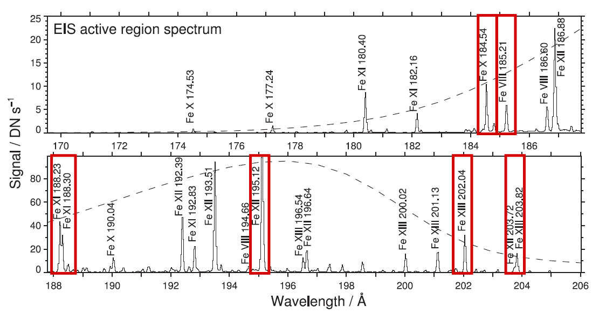

EIS Data Overview
=================

The EUV Imaging Spectrometer — EIS — was designed to study the solar
atmosphere and answer fundamental questions on the heating of the solar
corona, the origin of the solar wind, and the release of energy in solar
flares [#]_. EIS observes two wavelength bands in the extreme ultraviolet,
171–-212 Å and 245–-291 Å, with a spectral resolution of about 22 mÅ and a
plate scale of 1″ per pixel. However, it is not practical to observe the
entirety of these bands at all times; therefore EIS observations are typically
collected in discrete spectral "windows" containing a smaller wavelength range
centered on select lines of interest. These windows can vary depending on the
particular study and a single EIS observation can contain up to 25 windows.

   Example EIS spectrum of an active region on 2006 November 4 observed in
   the 171–-212 Å EUV band. Red boxes demonstrate the bounds of some common
   spectral windows used by observation planners. The dashed line shows the
   effective area of EIS, which determines the sensitivity of the instrument
   to specific wavelengths. Adapted from Figure 2 of Young et al., 2007 [#]_

EIS has two basic modes of operation, "scan" and "sit-and-stare", which
comprise ~89% and 11% of all observations respectively. In scan mode, solar
images are made by stepping the slit over a region of the Sun and taking an
exposure at each position. Sit-and-stare observations, on the other hand,
involve taking one or more long exposures of a single location. The EIS slit
is always oriented along the Solar-Y (north-south) axis. As a consequence,
scan positions are always stepped along the Solar-X (east-west) axis, starting
at the edge of the observed region nearest the solar west limb and proceeding
towards the east limb.

A detailed description of EIS is given in the instrument paper [#]_. At the
beginning of the Hinode mission, the strategy was to release unprocessed
level-0 FITS files and software routines written in IDL for processing these
files into a format that could be used for data analysis. Additionally, all of
the routines for computing ancillary information, such as the offsets of the
detectors or the magnitude of the instrumental broadening, were all written in
IDL. Unfortunately, IDL is an expensive, proprietary language, little used
outside of solar physics. Python, in contrast, is a free, open source language
that has grown dramatically in popularity since the launch of Hinode, making
it an obvious choice for future software development.

EIS Level-1 HDF5 Files
----------------------

To accelerate the transition to Python we have created a new level-1
product that contains both the processed level-1 data and all ancillary
information needed for data analysis. The alternative approach, to port
all of the existing IDL software to Python, would be time consuming and
create confusion about which routines are being actively supported
during the transition. Distributing level-1 files removes this problem,
but does make the user dependent on the team for reformatting all of the
files as bugs are discovered. Since the mission has been going on for
some time now, the number of bugs is likely to be small.

There are several other design decisions that merit some explanation

-  The data and header information are stored in separate files. Since
   the data is large and unlikely to change, the time-consuming download
   of these files should only need to be done once. The header file is
   very small and can be updated easily.

-  HDF5 is used to store the data. This is a very widely used,
   high-performance file format that is well supported by both IDL and
   Python. The most attractive feature for this application is that data
   is stored in a self-documenting, directory-like tree structure
   instead of binary table extensions.

-  The data is processed from raw “data numbers” to “photon events” or
   “counts”. The default behavior of ``eis_prep`` is to convert to
   calibrated units. With the HDF5 files, conversion to absolute units is
   done using a calibration curve in the header file, and several
   different calibration curves can be considered.

The processed level-1 HDF5 files can be downloaded either directly from
the NRL Hinode/EIS website at https://eis.nrl.navy.mil/ or using the
tools included in EISPAC. The chapter on :ref:`sec-prep` describes how
the files were processed.

.. Note:: The HDF5 data archive currently only contains the science
   observations from the 1″ & 2″ slit positions. Engineering, calibration,
   and 40″ & 266″ slot data are therefore *not* available as HDF5 files.

.. rubric:: Footnotes and Citations

.. [#] EIS is part of the Hinode mission and was sponsored by the Japan
   Aerospace Exploration Agency (JAXA), the United Kingdom Space Agency (UKSA),
   and National Aeronautics and Space Administration (NASA) with contributions
   from ESA and Norway. Hinode was launched on September 22, 2006 at 21:36 UTC
   from the Uchinoura Space Center in Japan and continues to operate.

.. [#] Young, P. R., Del Zanna, G., Mason, H. E., et al. 2007,
   *Publ.* *Astron.* *Soc.* *Japan*, **59**, S857

.. [#] Culhane, J. L., Harra, L. K., James, A. M., et al. 2007,
   *Sol.* *Phys.*, **243**, 19
