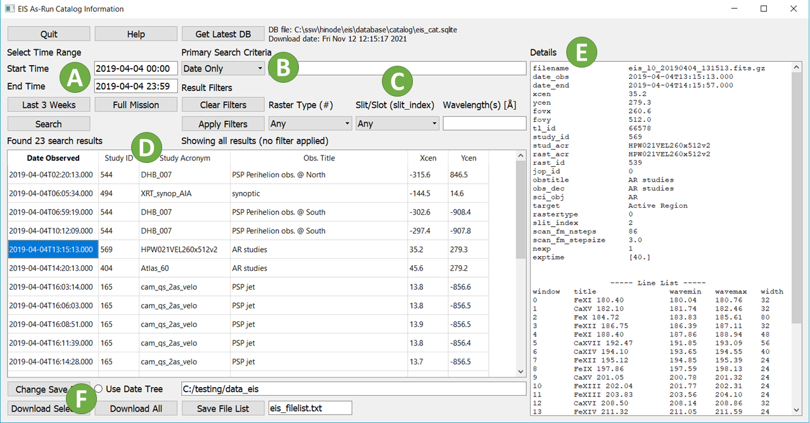
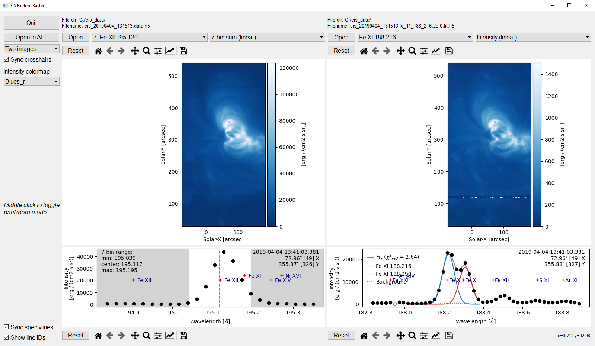
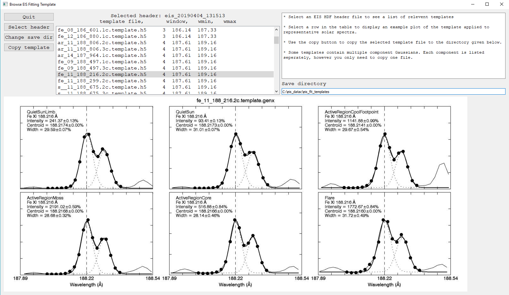

.. _sec-scripts:

Command Line Scripts
====================

The command line scripts should be automatically installed and
registered with your OS as part of installing EISPAC. These scripts are
designed to help users quickly search, download, and fit Gaussian
functions to the data, all without needing to write a full Python program.
To use a script, simply enter its name in the command line from any directory
in which you have read and write privileges.

.. tip::
   Some scripts will default to saving files to your current working
   directory, therefore we recommend running the scripts from the directory
   in which you intend to do most of your analysis.

There are currently five command line scripts available,

-  ``eis_catalog`` - GUI tool from searching the as-run EIS data catalog and
   downloading the HDF5 files your computer. Can also generate a text list of
   files to download.

-  ``eis_explore_raster`` - **New in 2024-July-11** GUI tool for viewing and
   exploring the contents of one or more EIS rasters. Can be used on both 
   level-1 HDF5 files and fit results produced by EISPAC.

-  ``eis_browse_templates`` - GUI tool for browsing the fit templates
   corresponding to each spectral window in a given EIS observation and
   copying the template files from EISPAC to your current working directory
   (fit templates are explained more in the :ref:`sec-fitting` chapter).

-  ``eis_download_files`` - Command line tool for downloading a the level-1
   HDF5 files associated with one or more level-0 EIS fits files. Can also
   download an entire list of files using the text output of ``eis_catalog``.
   Example usage,

   ::

      >>> eis_downdload_files eis_l0_20190404_131513.fits

-  ``eis_fit_files`` - Command line tool for fitting all of the HDF5 files
   in a given directory with each fit template found in another directory.
   Example usage,

   ::

      >>> eis_fit_files ./eis_study/ ./eis_study/templates/

-  ``eis_plot_fit`` - Command line tool for a quick-look plot of fit line
   intensity, velocity, and width.
   Example usage,

   ::

      >>> eis_plot_fit eis_20190404_131513.fe_12_195_119.2c-0.fit.h5'

.. tip::
   ``eis_fit_files`` and ``eis_plot_fit`` can also be run without any filename
   arguments. In such cases, the script will attempt to execute its function
   using all relevant files in your current working directory.

.. _sec-catalog:

eis_catalog
-----------

The ``eis_catalog`` GUI tool can be used to search the EIS as-run catalog and
download HDF5 files to your local file system. To launch it, simply type
``eis_catalog`` in the command line of the environment where you installed
EISPAC. If you have a working IDL installation of SolarSoft, the tool will
attempt to locate a copy of the ``eis_cat.sqlite`` database on your computer.
Otherwise, the program will try to download the database the first time you
start the GUI. Please be patient, downloading the full catalog can take a
minute or two.

   The main window of the `eis_catalog` GUI tool. Please see the text for
   details about each of the labeled sections.

Above is an image of the main `eis_catalog` window. Some notes on the various
sections of the interface.

A. **Time** **Range**: ISO format (YYYY-MM-DD HH:MM) is recommended but not
   required. If no end time is given, the program will search the 24 hour
   time period following the start time.

B. **Primary** **Search** **Criteria**: Select an option from the dropdown
   list and enter your search value in the adjacent box. Current options
   include "Date only", "Study ID", "Study Acronym", "HOP ID", "Target",
   "Sci. Obj.", and "Obs. Title". Click the "help" button in the GUI to
   get and short description of each option. Please be advised, "Date only"
   searches over long time periods can take a while to process.

C. **Result** **Filters**: Filter the search results by raster type,
   slit/slot position, and observed wavelengths (in units of Å). Multiple
   wavelengths can be given as a comma separated list. Note: applying or
   removing a filter does not re-run the search, however it may take a
   moment to update the list if there are a lot of results.

D. **Search** **Results**: List of all EIS observations matching your search
   criteria and filters. Clicking on any row in the list will display
   additional information about that observation in the "Details" panel.

E. **Details**: General use panel for displaying help information,
   observation details, and status updates. Newer versions of the GUI have
   addtional tabs here for viewing context images from SDO / AIA 
   (or SOHO / EIT before 2010-May) as well as general help information.

F. **Download** **Controls**: Select output directory, download selected
   file, download all files in the list (use with care!), or make a text
   list of the filenames. Progress bars for each file download will be
   printed to your console, NOT the details pane (this will be redirected
   better in a future update). If the "Use Date Tree" box is checked, files
   will be downloaded into subdirectories organized by month and day.

.. _sec-explore:

eis_explore_raster
------------------

**New in 2024-July-11** The ``eis_explore_raster`` GUI tool can be used to 
view and explore the contents of one or more EIS rasters. The interface 
works with both a level-1 HDF5 files and fit results produced by EISPAC 
(as saved using the `~eispac.core.save_fit` function). More information 
about fitting is given in the :ref:`sec-fitting` chapter.

   The main window of the `eis_explore_raster` GUI tool. The left image is
   showing level-1 data in the Fe XII 195.119 window while the right image
   is plotting the fit results for the Fe XI 188.299 lines. 

Assorted program controls (including the number of image panels displayed)
are found at far left of the GUI. Each image panel can load a different data
file. Use the drop-down lists to select the spectral window and parameter 
(and scaling method) to display. Clicking on any raster image will select and 
plot the spectrum at that location. By default, selections will be synchronized 
between panels using physical coordinates, reguardless of the image timestamps.
Middle clicking any plot will toggle pan/zoom mode for that plot. When toggled 
on, left click and drag the plot to pan or right click and move your mouse 
right (or up) to to zoom in and left (or down) to zoom out.

When viewing a level-1 file, clicking on the spectrum will select the center of 
the wavelength range used to compute the summed raster image. Please note: the 
data are plotted after including all wavelength corrections, which can result
in offsets relative to the bin indices used for the sum. Loading a fitting 
result will also plot all component Gaussians used in the fit. Markers showing
the theoretical, rest wavelengths of different spectral lines (as given in the 
`CHAINTI atomic database <https://www.chiantidatabase.org/>`_) can be toggled
with the "Show line IDs" checkbox in the bottom left of the GUI. 

.. _sec-browse:

eis_browse_templates
--------------------

The ``eis_browse_templates`` GUI tool can be used to view and copy fit
templates included with EISPAC. Once the GUI is open, use the
"Select Header" button to load an HDF5 header file and see a list of
templates available for all spectral windows in the associated data file.
Clicking on a template name in the list will display an example plot of
the template relative to representative solar spectra (NOT the data in the
actual observation). You can then use the "Copy template" button to make a
copy of the template file in the output directory. Fit templates are
explained more in the :ref:`sec-fitting` chapter.

   The main window of the `eis_browse_templates` GUI tool.