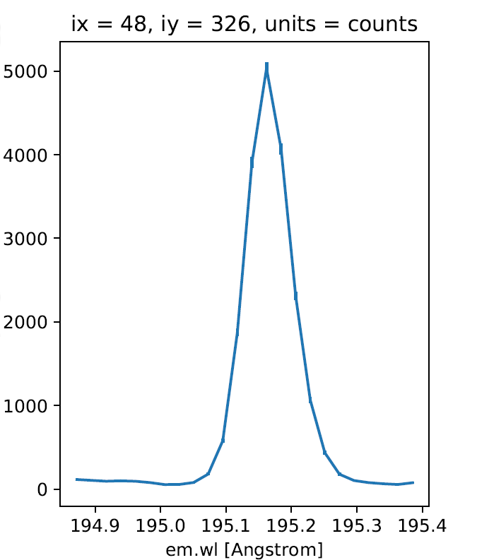
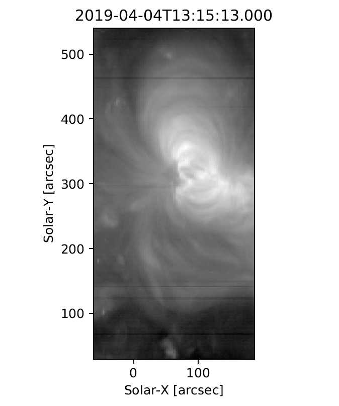

Exploring EIS data
==================

Once installed, EISPAC can be imported into any Python script or
interactive session with a simple ``import eispac`` statement.

.. _sec-read:

Reading Data into Python
------------------------

Assuming you have already downloaded some data, the following code snippet
below illustrates how to how to read the level-1 data from the spectral
window containing the 195.12 Å line (window 7, in our example file). At the
end of the chapter we will show how to examine a data header file to
determine what wavelengths are available in a given observation.

.. code:: python

   >>> import eispac
   >>> data_filename = 'eis_20190404_131513.data.h5'
   >>> data_cube = eispac.read_cube(data_filename, 195.119)

The `~eispac.core.read_cube()` function will read and apply all of the
calibration and pointing corrections necessary for scientific analysis. The
function has three key arguments (see the full documentation for additional
keywords for specifying your own calibration curve or a count offset):

* **filename** (str or pathlib path) - Name or path of either the data or
  head HDF5 file for a single EIS observation

* **window** (int or float, optional) - Requested spectral window number
  (if <= 24) or the value of any wavelength within the requested window
  (in units of [Angstrom]). Default is "0"

* **apply_radcal** (bool, optional) - If set to True, will apply the
  pre-flight radiometric calibration curve found in the HDF5 header file
  and set units to :math:`erg/(cm^2 s sr)`. If set to False, will simply
  return the data in units of photon counts. Default is True.

EISCube Objects
---------------

The return value of `~eispac.core.read_cube` is an `~eispac.core.EISCube`
class instance which contains calibrated intensities (or photon counts),
corrected wavelengths, and all of the associated metadata. `~eispac.core.EISCube`
objects are a subclass of `~ndcube.NDCube` (from the Sunpy-affiliated
package of the same name) and, as such, have built-in slicing and coordinate
conversion capabilities as virtue of having an associated World Coordinate
System (WCS) object.

The `~eispac.core.EISCube` subclass extends `~ndcube.ndcube` by including
a few additional features. First, an extra ``.wavelength`` attribute has
been added which contains a 3D array with the corrected wavelength values
at all locations within the cube. This correction accounts for two effects
(1) a systematic spectral shift caused by a tilt in the orientation of the
the EIS slit relative to the CCD and (2) a variable spectral shift caused
by the orbit of the spacecraft. Secondly, four methods are included to
quickly perform common EIS image manipulations,

-  The `~eispac.core.EISCube.apply_radcal` and `~eispac.core.EISCube.remove_radcal`
   methods can be used to convert the data and uncertainty values to and
   from intensity and photon count units using either the pre-flight
   radiometric calibration curve provided in the HDF5 header file (default)
   or a user-inputted array. If `~eispac.core.EISCube.apply_radcal` is given
   a custom calibration curve, the number of data points in the input array
   must match the number of data points along the wavelength axis.

-  The `~eispac.core.EISCube.sum_spectra` method sums the data along the
   wavelength axis and returns a new, 2D ``NDCube`` with just the data
   (no uncertainty or wavelength information). It requires no arguments.

-  The `~eispac.core.EISCube.smooth_cube` method applies a boxcar moving
   average to the data along one or more spatial axes. It requires a single
   argument, "width", that must be either a singular value or list of ints,
   floats, or `astropy.units.Quantity` instances specifying the number of
   pixels or angular distance to smooth over. If given a single value,
   only the y-axis will be smoothed. Floats and angular distances will
   be converted to the nearest whole pixel value. If a width value is
   even, width + 1 will be used instead. `~eispac.core.EISCube.smooth_cube`
   also accepts any number of optional keyword arguments that will be passed
   to the `astropy.convolution.convolve` function, which does the actual
   smoothing operation.

The calibrated intensity and uncertainty values are stored in numpy
arrays in the ``.data`` and ``.uncertainty`` attributes. The order of
the axes are (slit position, raster step, dispersion) which correspond
to the physical axes of (Solar-Y, Solar-X, Wavelength). You can inspect
the dimensions of an `~ndcube.NDCube` object like so,

.. code:: python

   >>> data_cube.dimensions
   [512, 87, 24] pix

As you can see, our example data has dimensions of ``(512, 87, 24)``.
That is, 512 pixels along the slit (in the Solar-Y direction), 87 raster
steps (along the Solar-X axis), and 24 pixels along the dispersion
(wavelength) axis.

Slicing an EISCube
------------------
One of the most powerful features of `~ndcube.NDCube`-based objects is the
ability to slice using either array indices or world coordinates. Slicing
by array indices works just like slicing a normal ``numpy`` array. Slicing
by coordinates is done using the `ndcube.NDCube.crop` method and a collection
of two or more points constructed using high level coordinate objects from
`astropy.coordinates`. Note: for spatial coordinates, you must specify the observer
frame, which can be constructed using the ``EISCube.wcs`` object.

For example,

.. code:: python

   >>> import astropy.units as u
   >>> from astropy.coordinates import SkyCoord, SpectralCoord
   >>> from astropy.wcs.utils import wcs_to_celestial_frame
   >>> eis_frame = wcs_to_celestial_frame(data_cube.wcs)
   >>> lower_left = [SpectralCoord(195.0, unit=u.angstrom),
   ...               SkyCoord(Tx=48, Ty=225, unit=u.arcsec, frame=eis_frame)]
   >>> upper_right = [SpectralCoord(195.3, unit=u.AA),
   ...                SkyCoord(Tx=165, Ty=378, unit=u.arcsec, frame=eis_frame)]
   >>> data_cutout = data_cube.crop(lower_left, upper_right)
   >>> data_cutout.dimensions
   [154, 48, 14] pix

Slicing an `~eispac.core.EISCube` also automatically slices all of
the associated subarrays (data, uncertainty, wcs, and wavelength). Please
see the `ndcube documentation <https://docs.sunpy.org/projects/ndcube/en/stable/index.html>`_
for more information about slicing and manipulating `~ndcube.NDCube` objects.

.. Attention::
   Slicing the wavelength axis with ``.crop()`` uses the wavelength values
   in the WCS object, NOT the corrected values stored in ``.wavelength``.
   Please use with care. If you don't want or need to slice along the
   wavelength axis, simply give the function a value of None instead of a
   ``SpectralCoord`` object.

Exploring Metadata
------------------

All metadata and information from the HDF5 header file are packed into a
single dictionary stored in the ``.meta`` attribute of the `~eispac.core.EISCube`.
The structure of the ``.meta`` dictionary mirrors the internal structure
of the HDF5 file, with a few extra keys added for convenience. You can
explore the contents with the usual Python commands,

.. code:: python

   >>> data_cube.meta.keys()
   dict_keys(['filename_data', 'filename_head', 'wininfo', 'iwin', 'iwin_str',
              'index', 'pointing', 'wave', 'radcal', 'slit_width',
              'slit_width_units', 'ccd_offset', 'wave_corr', 'wave_corr_t',
              'wave_corr_tilt', 'date_obs', 'date_obs_format', 'duration',
              'duration_units', 'mod_index', 'aspect', 'aspect_ratio', 'notes'])
   >>> data_cube.meta['pointing']['x_scale']
   2.9952
   >>> data_cube.meta['radcal']
   array([8.06751  , 8.060929 , 8.054517 , 8.048271 , 8.042198 , 8.036295 ,
          8.030562 , 8.024157 , 8.017491 , 8.010971 , 8.0046015, 7.998385 ,
          7.9923196, 7.9864078, 7.980654 , 7.975055 , 7.969617 , 7.9643393,
          7.959224 , 7.9542727, 7.949487 , 7.9448686, 7.9404206, 7.9361415],
         dtype=float32)

.. sidebar:: Assorted metadata

   For completeness and transparency, we have bundled all of the commonly used
   instrumental and processing metadata provided in IDL. EISPAC attempts to
   correct for most instrumental effects, so you will not need to
   reference the ``ccd_offset`` or ``wave_corr_tilt``, for example, but that
   information is there if you want it. As a reminder, the ``slit_width`` array
   gives the empirically-determined instrumental broadening along the EIS slit,
   and not the physical width of the slit itself.

Here ``x_scale`` is the number of arcsec between step positions in the raster.
Most EIS rasters take more than 1 arcsec per step, which degrades the spatial
resolution but increases the cadence. The variable ``radcal`` is the
pre-flight calibration curve for this data window. It includes all of
the factors for converting counts directly to :math:`erg/(cm^2 s sr)`.

Of particular note, the ``.meta['index']`` dictionary contains the original
EIS Level-0 FIT header keywords. Be aware, the pointing information in the
Level-0 header is uncorrected. The ``.meta['mod_index']`` (modified index)
dictionary contains a reduced set of header keywords *including* all pointing
corrections. Additionally, the ``mod_index`` values are updated by EISPAC
whenever the `~eispac.core.EISCube` is sliced while the original index is
not updated.

Spectral Windows
----------------

We usually don’t care about the numbering of the data windows. It’s more
natural to want to read the data corresponding to a particular
wavelength. The `~eispac.core.read_wininfo` function can be used help
identify the spectral contents of each data window. The function takes
an input header file and returns a `numpy.recarray` containing the window
numbers, min and max wavelengths and primary spectral line for each data
window. Note: for your convenience, a copy of the ``wininfo`` array is
also stored in the ``EISCube.meta`` dictionary.

.. code:: python

   >>> import eispac
   >>> header_filename = 'eis_20190404_131513.head.h5'
   >>> wininfo = eispac.read_wininfo(header_filename)
   >>> wininfo.dtype.names
   ('iwin', 'line_id', 'wvl_min', 'wvl_max', 'nl', 'xs')
   >>> wininfo[0:4]
   rec.array([(0, 'Fe XI 180.400', 180.03426, 180.72559, 32, 661),
              (1, 'Ca XV 182.100', 181.75139, 182.44266, 32, 738),
              (2, 'Fe X 184.720', 183.82512, 185.5865 , 80, 831),
              (3, 'Fe XII 186.750', 186.3891 , 187.0802 , 32, 946)],
              ... ... ...
              (23, 'Mg VII 280.390', 279.7766 , 280.9996 , 56, 3720),
              (24, 'Fe XV 284.160', 283.89   , 284.40134, 24, 3905)],
             dtype=[('iwin', '<i4'), ('line_id', '<U64'), ('wvl_min', '<f4'),
                    ('wvl_max', '<f4'), ('nl', '<i4'), ('xs', '<i4')])

We can then use a `numpy.where` call on the ``wininfo`` array to map
wavelength to window number. Users familiar with IDL may be interested
to note that numpy record arrays can be accessed like an IDL array of
structures (e.g. instead of ``wininfo['wvl_min']`` below, you could also use
``wininfo.wvl_min``).

.. code:: python

   >>> import numpy as np
   >>> wvl = 195.119
   >>> p = (wininfo['wvl_max'] - wvl)*(wvl - wininfo['wvl_min'])
   >>> iwin = np.where(p >= 0)[0]
   >>> iwin
   array([7], dtype=int64)

If the result is an empty array, the wavelength is not in the data.

Plotting
--------

We can make a quick image of the EIS data by making use of the
``.plot()`` method provided in all `~ndcube.NDCube` objects (note, it
usually helps to sum along the dispersion direction first).

.. code:: python

   >>> data_cube.sum_spectra().plot(aspect=data_cube.meta['aspect'])

The ``.plot()`` method can also be used to display the spectrum from a
single pixel, as shown below. For illustration, we also convert the data
back in units of photon counts (this is the same as dividing the
calibrated data by the ``.meta['radcal']`` array).

.. code:: python

   >>> ix = 48
   >>> iy = 326
   >>> spec = data_cube[iy,ix,:].remove_radcal()
   >>> spec_plot = spec.plot()
   >>> spec_plot.set_title(f'ix = {ix}, iy = {iy}, units = counts')

.. _fig-spectrum:

  An example Fe XII 195.119 Å line profile from the raster.

To perform more advanced plotting, such as logarithmically scaling the
intensities, you will need to extract the data from the `~eispac.core.EISCube`
and create the figure yourself using any of the various Python plotting
libraries. For example,

.. code:: python

   import numpy as np
   import matplotlib.pyplot as plt
   import eispac

   data_filename = 'eis_20190404_131513.data.h5'
   data_cube = eispac.read_cube(data_filename, 195.119)
   raster_sum = np.sum(data_cube.data, axis=2) # or data_cube.sum_spectra().data
   scaled_img = np.log10(raster_sum)

   plt.figure()
   plt.imshow(scaled_img, origin='lower', extent=data_cube.meta['extent_arcsec'], cmap='gray')
   plt.title(data_cube.meta['date_obs'][-1])
   plt.xlabel('Solar-X [arcsec]')
   plt.ylabel('Solar-Y [arcsec]')
   plt.show()

.. tip::
   Setting both "aspect" (y_scale/x_scale) and "extent" (data range as
   [left, right, bottom, top]) in ``plt.imshow()`` can sometimes give
   unexpected results. You may need to experiment with the combination of
   keywords needed to get the plot you expect.

.. _fig-raster:

   An example image formed by summing the data for the Fe XII spectral window
   in the dispersion direction. In a subsequent chapter we'll discuss fitting
   the spectra.

.. rubric:: Footnotes

.. [#] The ``.crop()`` method was added in ``NDCube`` 2.0. In older versions
   of the code (before 2021-10-29), there was a method called ``.crop_by_coords``
   which worked slightly differently.
