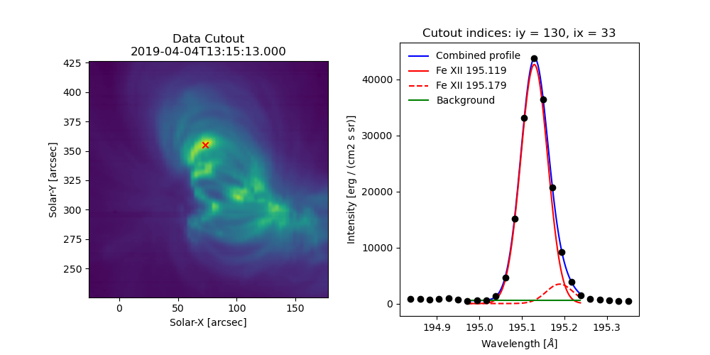
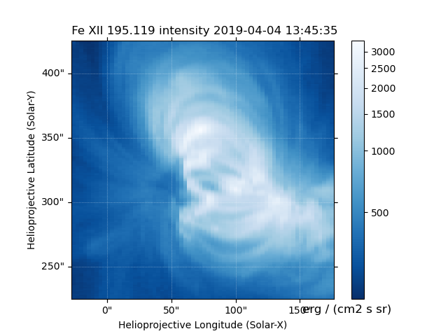
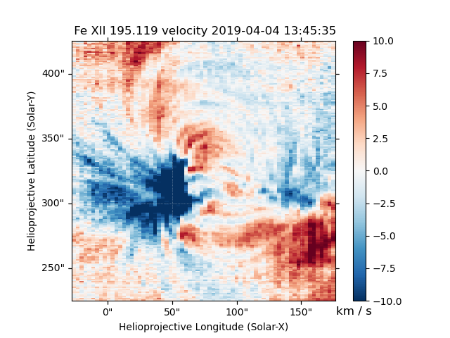

.. _sec-fitting:

Fitting the Data
================

.. sidebar:: Why use MPFIT?

   We have chosen to use MPFIT due to its flexibility and long (20+ year)
   legacy in solar and heliophysics. While newer fitting methods provide
   powerful tools for data exploration, they are still young and incur
   significant additional computation time (and are also more complicated
   to parallelize).

Fitting of the spectra involves selecting a spectral line of interest
(e.g. 195.119 Å) from one of the spectral windows of in the data,
choosing a function (or combination of functions) to fit, and
determining an initial guess for each parameter. The next ingredient for
a fit is the selection of an optimization method. By default, EISPAC
uses a Python implementation of the well-known IDL method **MPFIT**,
which solves the non-linear least squares problem using the Levenberg-
Marquardt algorithm. The Python module, ``mpfit.py``, is included in EISPAC 
and the orginal source code can found on GitHub [#]_. Future versions of 
of EISPAC may include support for other fitting packages such as the newer
`astropy.modeling` framework.

Template Files
--------------

In order to make fitting quick and easy, we’ve created a set of fit
templates for different spectral lines. Each template consists of one
or more component Gaussian functions and a constant background term.
Template files are named according to the following pattern:
``{primary spectral line}.{number of Gaussians}c.template.h5``. 119
templates are provided with EISPAC, covering all of the commonly observed
spectral line combinations.

The easiest way to browse and copy fit template files is to use the
``eis_browse_templates`` GUI tool included with EISPAC. This tool can be
used to display a list of all templates available for each spectral window
in an EIS observation and copy the template files to your work directory
(see the :ref:`sec-browse` section for a few tips). A similar result can be
obtained with the `~eispac.core.match_templates` function, which takes either
an `~eispac.core.EISCube` or the path to a header file and outputs a list
(or list of lists) of all fit templates available for a given spectral window
(or data file).

.. code:: python

   >>> import eispac
   >>> data_filename = 'eis_20190404_131513.data.h5'
   >>> data_cube = eispac.read_cube(data_filename, 195.119)
   >>> template_list = eispac.match_templates(data_cube)
   >>> for file in template_list:
   >>>     print(file.name)
   fe_12_195_119.1c.template.h5
   fe_12_195_119.2c.template.h5
   fe_12_195_179.2c.template.h5

In the example above, notice how both one and two component fits are available
for the same line. Furthermore, as with many multi-component templates, the
third template file is actually a duplicate of the second template, just with
the name of the secondary spectral line in the filename. This was designed to
make it easier to see exactly which spectral lines can be fit. However, it
also means you cannot simply loop over all template files available for a
given spectral window, as you would be unnecessarily multiplying the amount
of fitting performed (and resultant output files).

We recommend copying the template files you wish to use to your project
directory so you have a more self-contained record of your fitting process.
Assuming you are running Python from your project directory, the following
code snippet illustrates one method you could use.

.. code:: python

   >>> import os
   >>> import shutil
   >>> current_dir = os.getcwd()
   >>> shutil.copy(template_list[1], current_dir)

.. Attention::
   Take care to only *copy* template files. Moving a template from your
   EISPAC installation will lead to incomplete results in future calls
   to ``match_templates()``.

Loading Fit Templates
---------------------

An ``h5dump`` [#]_ on one of the template files shows that it contains a
``/template`` group for the initial guess on the fit parameters and a
``/parinfo`` group containing constraints on the parameters for use by
`~eispac.extern.mpfit`.

::

   h5dump -n fe_12_195_119.2c.template.h5
   HDF5 "fe_12_195_119.2c.template.h5" {
   FILE_CONTENTS {
    group      /
    group      /parinfo
    dataset    /parinfo/fixed
    dataset    /parinfo/limited
    dataset    /parinfo/limits
    dataset    /parinfo/tied
    dataset    /parinfo/value
    group      /template
    dataset    /template/component
    dataset    /template/data_e
    dataset    /template/data_x
    dataset    /template/data_y
    dataset    /template/fit
    dataset    /template/fit_back
    dataset    /template/fit_gauss
    dataset    /template/line_ids
    dataset    /template/n_gauss
    dataset    /template/n_poly
    dataset    /template/order
    dataset    /template/wmax
    dataset    /template/wmin
    }

The `~eispac.core.read_template` function can be used to read a template
file and examine the contents.

.. code:: python

   >>> import eispac
   >>> tmplt_filename = 'fe_12_195_119.2c.template.h5'
   >>> tmplt = eispac.read_template(tmplt_filename)

Use the command ``print(TEMPLATE)`` to view a summary of the template, intial
parameter values, and constraints in a nice format.

.. code:: python

   >>> print(tmplt)
   --- EISFitTemplate SUMMARY ---
   filename_temp: ./fe_12_195_119.2c.template.h5
   n_gauss: 2
   n_poly: 1
   line_ids: ['Fe XII 195.119' 'Fe XII 195.179']
   wmin, wmax: 194.9600067138672, 195.25

   --- PARAMETER CONSTRAINTS ---
    *            Value   Fixed     Limited              Limits                Tied
   p[0]     57514.6647       0     1     0       0.0000       0.0000
   p[1]       195.1179       0     1     1     195.0778     195.1581
   p[2]         0.0289       0     1     1       0.0191       0.0510
   p[3]      8013.4013       0     1     0       0.0000       0.0000
   p[4]       195.1779       0     1     1     195.1378     195.2181          p[1]+0.06
   p[5]         0.0289       0     1     1       0.0191       0.0510          p[2]
   p[6]       664.3349       0     0     0       0.0000       0.0000

.. sidebar:: funcinfo dictionary

   The ``EISFitTemplate`` object returned by ``eispac.read_template()`` also
   generates a ``.funcinfo`` list. This list will help with the implementation
   of other fitting methods in the future, but is currently not used by the
   code and can, thereby, be safely ignored.

The structure of ``parinfo`` is specific to MPFIT and should be familiar
to anyone who has used the original IDL version; please see the section
on :ref:`sec-parinfo` for more details. The templates provided
with EISPAC consist of one or more Gaussian functions (with parameters
in the order of peak, centroid, & width) followed by one or more
background polynomial terms (usually just a single, constant value). The
values ``.template['n_gauss']`` and ``.template['n_poly']`` indicate,
respectively, the number of Gaussian functions and background polynomial
terms in a given template.

.. Note:: The multigaussian function is composed of generalized Gaussian functions
   of the form :math:`f(x) = A exp(-(x-b)^2/2c^2)`, where A is the amplitude (peak value),
   b is the position of the center of the peak (centroid), and c is the standard
   deviation (width). This is consistent with the fit parameters used for EIS data
   in the IDL SolarSoftWare (SSW) analysis suite.

Custom Fit Templates
--------------------
EISPAC comes with a wide selection of templates that cover the most common EIS 
lines. However, you can also define a custom fitting template for more specific 
use-cases. There are two initialization methods available. First, you can call 
the `~eispac.core.EISFitTemplate` class directly and pass in the appropriate 
values and arrays. Here is an example for initializing a template with a single 
Gaussian function and constant background. 

.. code:: python

   >>> new_tmplt = eispac.EISFitTemplate(value=[57514.7, 195.1, 0.0289, 664.3], line_ids=['Fe XII 195.119'])

At minimum, you need to provide a ``value`` list or array giving the initial values 
for each fitting parameter. The order of parameters is assumed to be sets of 
[PEAK, CENTROID, WIDTH] for each Gaussian component followed, optionally, by the 
coefficients the background polynomial, starting with the LOWEST (constant) order 
term first. If only a ``value`` array is provided (as in the example above), the 
code will estimate the number of Gaussians and polynomial terms based on the total 
number of parameters. Other valid template keys include,

* **n_gauss** (int) - number of Gaussian components
* **n_poly** (int) - Number of background polynomial terms. 
  Common values are: 0 (no background), 1 (constant), and 2 (linear).
* **line_ids** (array-like) - Strings giving the line identification 
   for each Gaussian component. For example, "Fe XII 195.119". 
   If not specified, placeholder values of "unknown I {INITAL CENTROID VALUE}" 
   will be used.
* **wmin** and **wmax** (floats) - min and max wavelength value of data to use 
  for fitting. Any data in the window outside the range delimited by these two 
  keys will be ignored during fitting.

The following keys are all additional parameter constraints that will be stored 
in the ``.parinfo`` list of dicts. As such, they must be input as arrays or lists 
with the same number of elements as the ``value`` array. 
        
* **fixed** (0 or 1) - If set to "1", will not fit the parameter and just use initial value instead
* **limited** (two-element array-like) - If set to "1" in the first/second
  value, will apply and limit to the parameter on the lower/upper side
* **limits** (two-element array-like) - Values of the limits on the
  lower/upper side. Both "limited" and "limits" must be give together.
* **tied** (str) - String defining a fixed relationship between this
  parameters one or more others. For example "p[0] / 2" would define
  a parameter to ALWAYS be exactly half the value of the first parameter.

.. _sec-template_toml:

The second method for initializing a custom template is to write a separate 
TOML-formatted text file with all of the input parameters and then load the 
custom template file using the `~eispac.core.read_template`. This allows you to 
save, reuse, and share your templates without needing to copy/paste Python code. 
Please note: there is currently no function to export a template from EISPAC and 
save it to a TOML file; you will need to create the TOML file yourself using your 
favorite text editor. Below is an example TOML file with a copy of the 
two-component Fe XII 195.119 template provided with EISPAC.

::

   [template]
   n_gauss = 2
   n_poly = 1
   line_ids = ['Fe XII 195.119', 'Fe XII 195.179']
   wmin = 194.96 
   wmax = 195.25

   [parinfo]
   value = [
      57514.6647, 195.1179, 0.0289, 
      8013.4013, 195.1779, 0.0289, 
      664.3349
   ]
   fixed = [0,0,0,0,0,0,0]
   limited = [[1,0],[1,1],[1,1],[1,0],[1,1],[1,1],[0,0]]
   limits = [
      [1,0],[195.0778,195.1581],[0.0191,0.0510],
      [1,0],[195.1378,195.2181],[0.0191,0.0510],
      [1,0]
   ]
   tied = ['', '', '', '', 'p[1]+0.06', 'p[2]', '']

Assuming this was saved in a file named “custom_fe_12_195.toml”, you can then 
easily load it in using the command ``fe_12_tmplt = eispac.read_template(“custom_fe_12_195.toml”)``. 
For more information about TOML files, please see the 
`official documentation <https://toml.io/en/v1.0.0>`_

Fitting Spectra
---------------

Once you’ve read in a template file, you can use the central wavelength
to find the desired spectral window in the data using `~eispac.core.read_cube`.

.. code:: python

   >>> data_filename = 'eis_20190404_131513.data.h5'
   >>> data_cube = eispac.read_cube(data_filename, tmplt.central_wave)

As mentioned in the previous chapter, `~eispac.core.read_cube` automatically
applies all of the pointing and wavelength corrections, bad data
masking, and error estimations needed for scientific analysis. By
default, the code also converts the data from photon counts to intensity
units of erg cm\ :math:`^{-2}` s\ :math:`^{-1}` sr\ :math:`^{-1}` using
the appropriate pre-flight calibration curve. This conversion can be
disabled by setting the keyword ``apply_radcal=False``, should you
prefer to run your fits in count space.

.. sidebar:: Summary of fitting process

   Here's what's happening under the hood, ``fit_spectra()`` calls the
   helper function ``scale_guess()`` to scale the initial parameter values
   to the data, then ``mpfit`` is called to actually run the Levenberg-Marquardt
   fitting on a custom function that computes the deviates between the input
   spectrum and a multigaussian fit. If ``ncpu`` is set to a value > 1, then
   each raster step position will be processed separately and the full set of
   results will be combined into a single output.

On to the fitting! Now that you have a template and the data elements,
you can perform a fit of the entire data cube by calling the top-level
fitting routine, `~eispac.core.fit_spectra`. The easiest way to use
`~eispac.core.fit_spectra` is to just give it both an `~eispac.core.EISCube`
and `~eispac.core.EISFitTemplate` object (or filepaths to the data and
template HDF5 files). You may slice your `~eispac.core.EISCube` however
you wish before fitting and the code will loop over the data appropriately
(this includes fitting a single spectra or slit observation). Additionally,
`~eispac.core.fit_spectra` takes advantage of the ``multiprocessing`` package
in the Python standard library to automatically parallelize the fitting
process and minimize the run time. You may control the number of
processing cores used for the fitting with ``ncpu`` keyword, or set it
equal to "max" or ``None`` to use the maximum number of cores available.
Please see the full doc string for `~eispac.core.fit_spectra` for additional
options and parameters.

.. Attention::
   Due to the specifics of how the multiprocessing library works, any
   statements that call ``fit_spectra()`` using ncpu > 1 MUST be wrapped
   in a ``"if __name__ == __main__:"`` statement in the top-level script
   or program. If such a "name guard" statement is not detected,
   ``fit_spectra()`` will fall back to using a single process. Unfortunately,
   this means you can not directly use parallel fitting from an interactive
   Python shell, you must first write a program that you save and run.

Here is a minimal example program that just loads and fits the data.

.. code:: python

   import eispac

   if __name__ == '__main__':
       # input data and template files
       data_filepath = './eis_20190404_131513.data.h5'
       template_filepath = './fe_12_195_119.2c.template.h5'

       # read fit template
       tmplt = eispac.read_template(template_filepath)

       # Read spectral window into an EISCube
       data_cube = eispac.read_cube(data_filepath, tmplt.central_wave)

       # Fit the data, then save it to disk and test loading it back in
       fit_res = eispac.fit_spectra(data_cube, tmplt, ncpu='max')
       save_filepaths = eispac.save_fit(fit_res, save_dir='cwd')
       FITS_file = eispac.export_fits(fit_res, save_dir='cwd')
       load_fit = eispac.read_fit(save_filepaths[0])

.. Note:: The command line script ``eis_fit_files`` can be used to quickly
   fit a directory of files using one or more templates in another directory.

EISFitResult Objects
--------------------

`~eispac.core.fit_spectra` outputs an `~eispac.core.EISFitResult` object,
which may be saved to an HDF5 file and read back in later using the
`~eispac.core.save_fit` and `~eispac.core.read_fit` functions (as shown
in the example above). The output fit parameters are stored in a dictionary
of arrays.

.. code:: python

   >>> for key in fit_res.fit.keys():
   ...     print(f"{key:<15} {fit_res.fit[key].dtype} {fit_res.fit[key].shape}")

   line_ids        <U14 (2,)
   main_component  int16 ()
   n_gauss         int16 ()
   n_poly          int16 ()
   wave_range      float64 (2,)
   status          float64 (128, 32)
   chi2            float64 (128, 32)
   mask            int32 (128, 32, 24)
   wavelength      float64 (128, 32, 24)
   int             float64 (128, 32, 2)
   err_int         float64 (128, 32, 2)
   vel             float64 (128, 32, 2)
   err_vel         float64 (128, 32, 2)
   width           float64 (128, 32, 2)
   err_width       float64 (128, 32, 2)
   params          float64 (128, 32, 7)
   perror          float64 (128, 32, 7)
   component       int32 (7,)
   param_names     <U32 (7,)
   param_units     <U32 (7,)

We can extract an array of the fit parameters or intensity profile using
the `~eispac.core.EISFitResult.get_params` and
`~eispac.core.EISFitResult.get_fit_profile` methods. Both methods take
optional keywords for selecting the component number and/or an individual
pixel (using array coordinates). `~eispac.core.EISFitResult.get_fit_profile`
also has a ``num_wavelengths`` keyword that allows us to interpolate the
fit profile at a higher wavelength resolution than observed by EIS. The
use of these methods are demonstrated in the longer example program below,
which also shows one method for finding the indices and coordinates of
maximum intensity.

.. code:: python

   import numpy as np
   import matplotlib.pyplot as plt
   import astropy.units as u
   from astropy.coordinates import SkyCoord
   from astropy.wcs.utils import wcs_to_celestial_frame
   import eispac

   if __name__ == '__main__':
       # Read in the fit template and EIS observation
       data_filepath = './eis_20190404_131513.data.h5'
       template_filepath = './fe_12_195_119.2c.template.h5'
       tmplt = eispac.read_template(template_filepath)
       data_cube = eispac.read_cube(data_filepath, tmplt.central_wave)

       # Select a cutout of the raster
       eis_frame = wcs_to_celestial_frame(data_cube.wcs)
       lower_left = [None, SkyCoord(Tx=-25, Ty=225, unit=u.arcsec, frame=eis_frame)]
       upper_right = [None, SkyCoord(Tx=175, Ty=425, unit=u.arcsec, frame=eis_frame)]
       raster_cutout = data_cube.crop(lower_left, upper_right)

       # Fit the data and save it to disk
       fit_res = eispac.fit_spectra(raster_cutout, tmplt, ncpu='max')
       save_filepaths = eispac.save_fit(fit_res, save_dir='cwd')

       # Find indices and world coordinates of max intensity
       sum_data_inten = raster_cutout.sum_spectra().data
       iy, ix = np.unravel_index(sum_data_inten.argmax(), sum_data_inten.shape)
       ex_world_coords = raster_cutout.wcs.array_index_to_world(iy, ix, 0)[1]
       y_arcsec, x_arcsec = ex_world_coords.Ty.value, ex_world_coords.Tx.value

       # Extract data profile and interpolate fit at higher spectral resolution
       data_x = raster_cutout.wavelength[iy, ix, :]
       data_y = raster_cutout.data[iy, ix, :]
       data_err = raster_cutout.uncertainty.array[iy, ix, :]
       fit_x, fit_y = fit_res.get_fit_profile(coords=[iy,ix], num_wavelengths=100)
       c0_x, c0_y = fit_res.get_fit_profile(0, coords=[iy,ix], num_wavelengths=100)
       c1_x, c1_y = fit_res.get_fit_profile(1, coords=[iy,ix], num_wavelengths=100)
       c2_x, c2_y = fit_res.get_fit_profile(2, coords=[iy,ix], num_wavelengths=100)

       # Make a multi-panel figure with the cutout and example profile
       fig = plt.figure(figsize=[10,5])
       plot_grid = fig.add_gridspec(nrows=1, ncols=2, wspace=0.3)

       data_subplt = fig.add_subplot(plot_grid[0,0])
       data_subplt.imshow(sum_data_inten, origin='lower', extent=cutout_extent)
       data_subplt.scatter(x_arcsec, y_arcsec, color='r', marker='x')
       data_subplt.set_title('Data Cutout\n'+raster_cutout.meta['mod_index']['date_obs'])
       data_subplt.set_xlabel('Solar-X [arcsec]')
       data_subplt.set_ylabel('Solar-Y [arcsec]')

       profile_subplt = fig.add_subplot(plot_grid[0,1])
       profile_subplt.errorbar(data_x, data_y, yerr=data_err, ls='', marker='o', color='k')
       profile_subplt.plot(fit_x, fit_y, color='b', label='Combined profile')
       profile_subplt.plot(c0_x, c0_y, color='r', label=fit_res.fit['line_ids'][0])
       profile_subplt.plot(c1_x, c1_y, color='r', ls='--', label=fit_res.fit['line_ids'][1])
       profile_subplt.plot(c2_x, c2_y, color='g', label='Background')
       profile_subplt.set_title(f'Cutout indices: iy = {iy}, ix = {ix}')
       profile_subplt.set_xlabel('Wavelength [$\AA$]')
       profile_subplt.set_ylabel('Intensity ['+raster_cutout.unit.to_string()+']')
       profile_subplt.legend(loc='upper left', frameon=False)
       plt.show()

.. _fig-fit_example:

   Example data cutout (left) and fit profile (right) for the spectral
   window containing the Fe XII 195.119 Å line. The red X shows the
   location of the maximum summed intensity.

EISMaps for Sunpy
-----------------

The fit line intensities, velocities, and widths can be loaded into an
`~eispac.core.EISMap`, which is a subclass of `sunpy.map.Map`. This allow
us to leverage the full power of Sunpy to do all sorts of cool science like
comparing spacecraft locations, co-aligning images, reprojecting maps, and
performing field extrapolations (see the Map sections of the SunPy
`User's Guide <https://docs.sunpy.org/en/stable/guide/data_types/maps.html>`_ and
`Example Gallery <https://docs.sunpy.org/en/stable/generated/gallery/index.html#map>`_
for some demonstrations). You can get an `~eispac.core.EISMap` by either
using the `~eispac.core.EISFitResult.get_map` method or saving the
measurements to FITS files using `~eispac.core.export_fits` and then
loading them in with either ``eispac.EISMap(FILENAME)`` or even
``sunpy.map.Map(FILENAME)`` (assuming EISPAC is also imported in your
program).

For now, we will just show you some examples of the quick-look plots.

.. code:: Python

   >>> # Fit intensity (in a nice sunpy Map)
   >>> inten_map = fit_res.get_map(component=0, measurement='intensity')
   >>> inten_map.peek()

   Fit line intensity in a nice SunPy Map.

.. code:: Python

   >>> # Fit velocity map
   >>> # Note: You can also use positional arguments and abbreviations
   >>> vel_map = fit_res.get_map(0, 'vel')
   >>> vel_map.peek()

   Fit line velocity map.

.. Attention::
   While we have corrected the velocity maps for orbital effects, there
   are still some unknown uncertainties. This is largely the case for
   *ALL* EIS velocity maps, not just those computed by EISPAC. Please
   use with care.

.. rubric:: Footnotes

.. [#] Sergey Koposov's Python port of MPFIT can be found at
   https://github.com/segasai/astrolibpy/

.. [#] ``h5dump`` is a command line tool used to inspect the contents of
   an HDF5 file. It is included  the Anaconda Python distribution platform,
   but can also be installed on its own.
